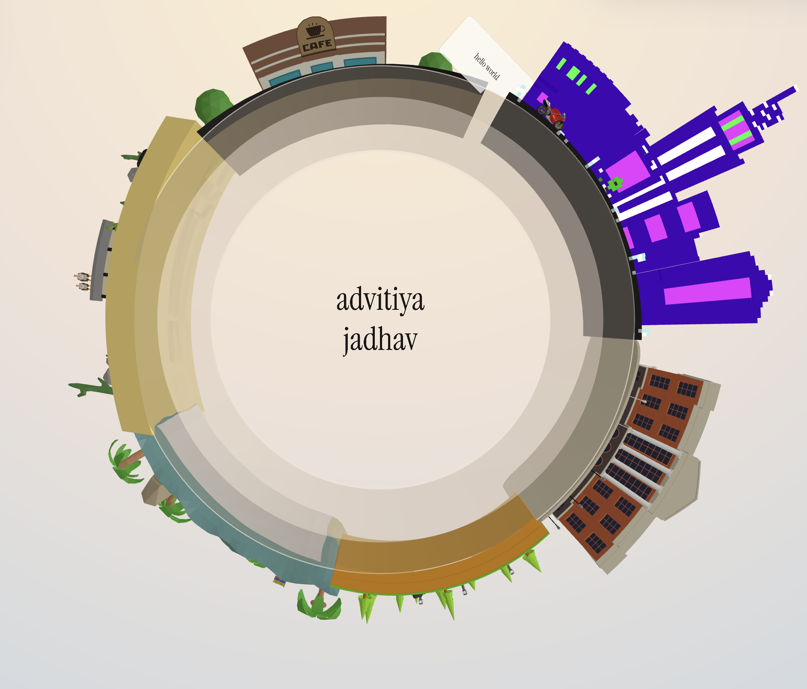

# Globe Portfolio

An interactive 3D low-poly globe portfolio showcasing my work experience, education at Purdue, skills, projects, and hobbies through rotating 3D scenes.



## Tech Stack

- **3D & Animation**: Three.js, GSAP, Meshopt GLTF Loader
- **Build & Styling**: Vite, JavaScript (ES Modules), Web Audio API, Vanilla CSS

## Features

- **Interactive 3D Sectors**: Resume, Education (Purdue), Skills, Experience (Milliman), Projects, and Hobbies.
- **Controls**: Keyboard (`←` `→` `Enter` `Space` `Esc`), touch swipe navigation, and radial dial.
- **Themes & Audio**: Dynamic day-night lighting cycles, theme presets, and background audio visualizer.

## Quick Start

```bash
npm install
npm run dev
```

## Roadmap

- [ ] Custom WebGL water & atmospheric shaders
- [ ] Interactive mini-game vehicle controls on globe surface
- [ ] Progressive Web App (PWA) offline support
